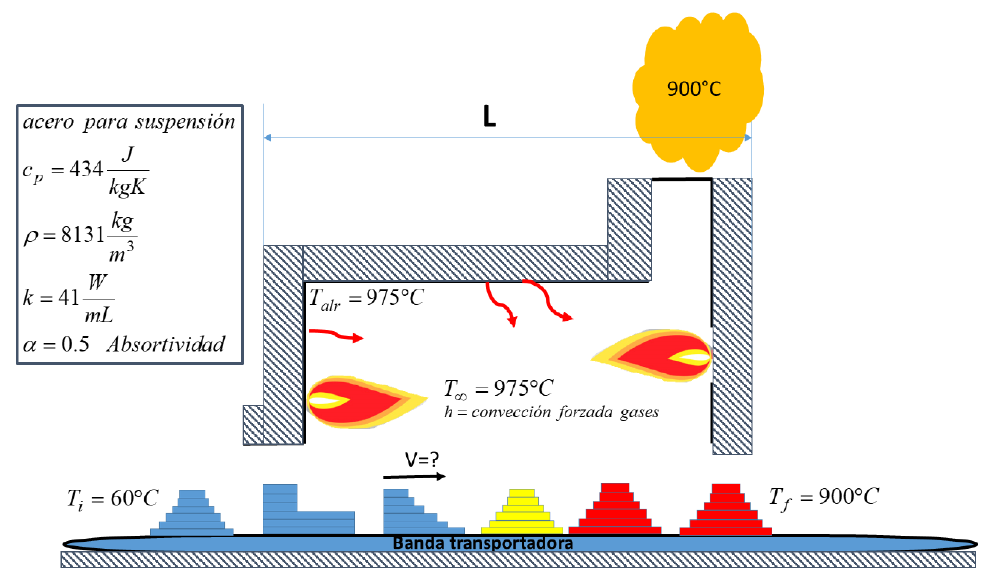

# Trabajo de Transferencia de Calor
## Autor
Santiago García Castrillón

## Profesores
Andrés Felipe Colorado Granda

Jaith Alfonso Agamez Parias

## Universidad
Universidad de Antioquia 

## Facultad
Facultad de Ingenieria

Departamento de Ingeniería Mecánica
# Simulación de una pieza al entrar a un horno

## Explicación del problema
Este ejercicio será la simulación del aumento de la temperatura de cada nodo de una pieza al entrar a un horno. Para realizar esta simulación se utilizaron las ecuaciones de transferencia de calor respectivas al modo de transferencia de calor, por ejemplo conducción, convección y radiación. Esta simulación se implementó en Python utilizando la librería Seaborn, especificamente utilizando los mapas de calor interactivos. 

El problema se describe completamente<a href="https://github.com/SantiagoGarciaC/heat-transfer-simulation/blob/main/Trabajo_de_metodos_numericos_2021-2.pdf"> aquí</a>. 

Los datos respectivos a la solución de este problema son los asociados al documento 1152469548

Las ecuaciones que implementamos en Python y el procedimiento que se realizó para cada nodo está disponible<a href="https://github.com/SantiagoGarciaC/heat-transfer-simulation/blob/main/Procedimiento.pdf"> aquí</a>. 

Los resultados de está simulación y la solución de preguntas propuestas está<a href="https://github.com/SantiagoGarciaC/heat-transfer-simulation/blob/main/Resultados.pdf"> aquí</a>.

También se anexaron unos videos que están disponibles para descargar en este repositorio donde se observa la simulación del mapa de calor para los dos problemas propuestos. El primer [video](https://youtu.be/4iL5V_Y4Lmc) muestra la simulación para el sistema con recuperación de calor, y el segundo [video](https://youtu.be/xNijQbl1nNI) muestra la simulación del sistema sin recuperación de calor.

## Datos
Pieza #3

a = 100 [cm].

L = 10 [m] Longitud del horno. 

h = 150 [W/m^2-K]  Coeficiente de convección.

    